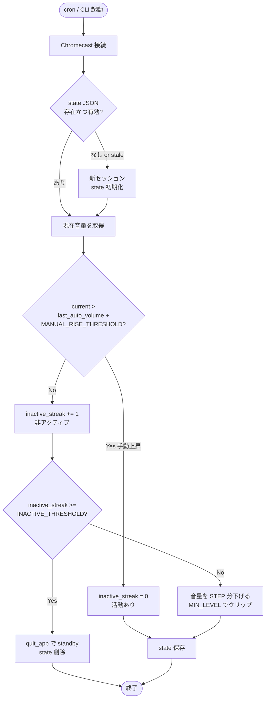

# ねむキャス (Nemucast) 🔊😴

Chromecast / Google TV の音量を自動で下げて、一定時間ユーザー操作がなければ standby にするツールです。  
Chromecast の active / idle 判定には頼らず、`前回自動設定した音量` と `現在音量` の差分からユーザー活動を判定します。


## 🎯 機能

- **活動判定を state で保持**: `last_auto_volume` と `inactive_streak` を JSON に保存します
- **手動上昇を検出**: 前回の自動設定音量より上がっていれば活動ありとみなします
- **定期実行にも連続実行にも対応**: 1回だけの tick 実行と、standby まで継続する session 実行の両方をサポートします
- **cron 用プロファイル付き**: 20:00 用と 00:30 用のコマンドをそのまま使えます

## 📋 必要な環境

- Python 3.11 以上
- 同一ネットワーク上に Chromecast / Google TV デバイス
- `uv`

## 🚀 インストール

```bash
git clone https://github.com/noricha-vr/nemucast.git
cd nemucast
uv sync
cp .env.example .env
```

## ⚙️ 基本設定

| 環境変数 | 説明 | デフォルト |
|---------|------|-----------|
| `CHROMECAST_NAME` | 通常実行時の対象デバイス名 | `"Dell"` |
| `STEP` | 1回で下げる音量幅 | `-0.04` |
| `MIN_LEVEL` | これ以上は下げない最小音量 | `0.3` |
| `INTERVAL_SEC` | 定期実行の想定間隔 | `1200` |
| `INACTIVE_THRESHOLD` | 連続非アクティブ回数のしきい値 | `3` |
| `MANUAL_RISE_THRESHOLD` | 手動上昇とみなす最小差分 | `0.01` |
| `STATE_FILE` | state JSON の保存先 | `logs/activity_state.json` |
| `STATE_STALE_INTERVAL_MULTIPLIER` | state を古いとみなす倍率 | `2` |
| `RUN_UNTIL_STANDBY` | standby まで interval ごとに継続実行するか | `0` |

state は `INTERVAL_SEC x STATE_STALE_INTERVAL_MULTIPLIER` より古いと破棄されます。

## 📖 使い方

### 1回だけ判定する通常実行

```bash
uv run nemucast
uv run nemucast --interval 900 --inactive-threshold 4
```

### standby まで継続する実行

```bash
uv run nemucast --interval 900 --inactive-threshold 4 --run-until-standby
```

## 🕘 cron 用プロファイル

### 20:00 用

- コマンド: `nemucast-cron-20`
- 既定値:
  - `CRON_20_INTERVAL_SEC=60`
  - `CRON_20_INACTIVE_THRESHOLD=1`
  - `CRON_20_MIN_LEVEL=0.05`
  - `CRON_20_STATE_FILE=logs/activity_state_20.json`
- 動き:
  - 20:00 に起動したらすぐ非アクティブ判定に到達し、そのまま standby します
  - 実質「20:00 になったらすぐ切る」プロファイルです

### 00:30 用

- コマンド: `nemucast-cron-0030`
- 既定値:
  - `CRON_0030_INTERVAL_SEC=900`
  - `CRON_0030_INACTIVE_THRESHOLD=4`
  - `CRON_0030_MIN_LEVEL=0.35`
  - `CRON_0030_STATE_FILE=logs/activity_state_0030.json`
- 動き:
  - 15分ごとに音量を下げながら判定を継続します
  - 音量操作が 45 分間なければ standby します
  - 途中で手動で音量を上げたら、非アクティブ回数をリセットして継続します

### cron 設定例

```cron
0 20 * * * cd /path/to/nemucast && /path/to/.venv/bin/nemucast-cron-20 >> /path/to/nemucast/logs/cron-20.log 2>&1
30 0 * * * cd /path/to/nemucast && /path/to/.venv/bin/nemucast-cron-0030 >> /path/to/nemucast/logs/cron-24.log 2>&1
```

## 🔧 動作の仕組み

1. Chromecast に接続
2. state JSON から `last_auto_volume` と `inactive_streak` を読む
3. 現在音量が `last_auto_volume + MANUAL_RISE_THRESHOLD` を超えていれば活動あり
4. 活動ありなら streak を `0` に戻す
5. 活動なしなら streak を `+1`
6. しきい値未満なら音量を 1 回下げる
7. しきい値以上なら standby にして state を削除する

### フロー図



stale 判定の条件: `now - updated_at > INTERVAL_SEC * STATE_STALE_INTERVAL_MULTIPLIER`（既定 2 倍）。
これを超えると state は破棄され、新セッションとして `inactive_streak = 0` から再スタートします。

### プロファイル別の設定値対比

同じロジックでも、プロファイルの設定値によって挙動が大きく変わります。

| 項目 | 通常実行 (`nemucast`) | 20:00 用 (`cron-20`) | 00:30 用 (`cron-0030`) |
|------|----------------------|----------------------|------------------------|
| `INTERVAL_SEC` | 1200（20分） | 60（1分） | 900（15分） |
| `INACTIVE_THRESHOLD` | 3 | 1 | 4 |
| `MIN_LEVEL` | 0.3 | 0.05 | 0.35 |
| standby までの最短時間 | 約 40 分（3 tick） | 即時（1 tick） | 約 45 分（4 tick） |
| 用途 | 任意のタイミングで段階的に静音化 | 「20:00 になったら即切る」運用 | 深夜 00:30 以降、徐々に下げて自然に切る運用 |

- `cron-20` は `INACTIVE_THRESHOLD=1` なので、起動 1 回目のチェックで即 standby に到達します。
- `cron-0030` は 15 分刻みで 4 回まで音量を下げながら待つため、途中で手動で音量を上げれば streak がリセットされ、視聴を続けられます。

## 📝 ログと state

- 実行ログ: `logs/lower_cast_volume.log`
- 20:00 用ログ例: `logs/cron-20.log`
- 00:30 用ログ例: `logs/cron-24.log`
- state:
  - 通常実行 `logs/activity_state.json`
  - 20:00 用 `logs/activity_state_20.json`
  - 00:30 用 `logs/activity_state_0030.json`

## ✅ テスト

```bash
uv run pytest -q
uv run ruff check
```

## 🪝 pre-commit フック

コミット前に `ruff check` と `ruff format --check` が自動で走るよう pre-commit フックを用意しています。
初回セットアップ時に以下を実行してください。

```bash
uv sync --all-groups
uv run pre-commit install
```

手動で全ファイルに対して実行する場合:

```bash
uv run pre-commit run --all-files
```
