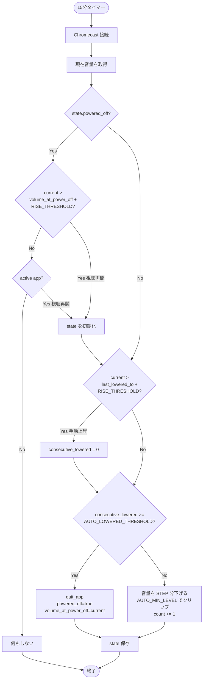

# ねむキャス (Nemucast) 🔊😴

Chromecast / Google TV の音量を自動で下げて、一定時間ユーザー操作がなければ standby にするツールです。  
Chromecast の active / idle 判定には頼らず、`前回自動設定した音量` と `現在音量` の差分からユーザー活動を判定します。


## 🎯 機能

- **活動判定を state で保持**: `last_auto_volume` と `inactive_streak` を JSON に保存します
- **手動上昇を検出**: 前回の自動設定音量より上がっていれば活動ありとみなします
- **定期実行にも連続実行にも対応**: 1回だけの tick 実行と、standby まで継続する session 実行の両方をサポートします
- **cron 用プロファイル付き**: 20:00 用と 00:30 用のコマンドをそのまま使えます

## 📋 必要な環境

- Python 3.11 以上
- 同一ネットワーク上に Chromecast / Google TV デバイス
- `uv`

## 🚀 インストール

```bash
git clone https://github.com/noricha-vr/nemucast.git
cd nemucast
uv sync
cp .env.example .env
```

## ⚙️ 基本設定

| 環境変数 | 説明 | デフォルト |
|---------|------|-----------|
| `CHROMECAST_NAME` | 通常実行時の対象デバイス名 | `"Dell"` |
| `STEP` | 1回で下げる音量幅 | `-0.04` |
| `MIN_LEVEL` | これ以上は下げない最小音量 | `0.3` |
| `INTERVAL_SEC` | 定期実行の想定間隔 | `1200` |
| `INACTIVE_THRESHOLD` | 連続非アクティブ回数のしきい値 | `3` |
| `MANUAL_RISE_THRESHOLD` | 手動上昇とみなす最小差分 | `0.01` |
| `STATE_FILE` | state JSON の保存先 | `logs/activity_state.json` |
| `STATE_STALE_INTERVAL_MULTIPLIER` | state を古いとみなす倍率 | `2` |
| `RUN_UNTIL_STANDBY` | standby まで interval ごとに継続実行するか | `0` |

state は `INTERVAL_SEC x STATE_STALE_INTERVAL_MULTIPLIER` より古いと破棄されます。

## 📖 使い方

### 1回だけ判定する通常実行

```bash
uv run nemucast
uv run nemucast --interval 900 --inactive-threshold 4
```

### standby まで継続する実行

```bash
uv run nemucast --interval 900 --inactive-threshold 4 --run-until-standby
```

## 🕘 タイマー用プロファイル

### 即時 standby（電源OFF相当）

- コマンド: `nemucast-standby`
- 動き:
  - 指定 Chromecast を発見して `quit_app` で即座に standby にします
  - 音量制御や state ファイルは使わない、最小構成のスクリプトです
- オプション:
  - `--name`: 対象デバイス名（デフォルト: `CHROMECAST_NAME` 環境変数 / `Dell`）
- 想定用途: 「20:00 になったら即切る」のような時刻指定の電源OFF

### 自動寝かしつけ（24h タイマー）

- コマンド: `nemucast-auto`
- 想定実行: 15 分間隔で常時稼働 (periodic-worker `--every 15m`)
- 動き:
  1. 直前 tick で電源OFFしていて、音量上昇または active app がなければ何もしない
  2. 電源OFF後に音量上昇または active app があれば「視聴再開」と判定し、通常フローに戻す
  3. 直前 script が下げた音量より上がっていれば「視聴中」と判定し、連続下げカウントを 0 に戻す
  4. 連続下げカウントが `AUTO_LOWERED_THRESHOLD` (既定 3) 以上なら `quit_app` で電源OFF
  5. それ以外は音量を `STEP` (既定 -0.04) だけ下げる。`AUTO_MIN_LEVEL` (既定 0.05) 以下なら下げないがカウントは進める
- 環境変数:
  - `AUTO_LOWERED_THRESHOLD`: 電源OFFまでの連続下げ回数。既定 `3`
  - `AUTO_MIN_LEVEL`: 下限音量。既定 `0.05`
  - `AUTO_STATE_FILE`: state ファイルパス。既定 `logs/auto_standby_state.json`
  - `AUTO_STATE_STALE_SEC`: これ以上間が空いた state は連続カウントを捨てる秒数。既定 `1800`（15分 x 2）
  - `STEP`, `MANUAL_RISE_THRESHOLD`, `CHROMECAST_NAME` は他コマンドと共通
- 終了コード: デバイスが見つからない場合は「寝かしつける対象がない」とみなして正常終了する（見つからない状態の方が長いため、失敗扱いにするとスケジューラの通知が埋もれる）
- 注意: 活動シグナルは音量変化と active app だけなので、音量に触れずに視聴し続けると時間帯を問わず約 45 分（15 分 x 3）で `quit_app` される
- state の扱い:
  - Mac のスリープ等でスケジューラが止まると連続カウントが実態とずれるため、`AUTO_STATE_STALE_SEC` を超えて間が空いた state はカウントを捨てて数え直す（視聴再開直後に電源OFFされるのを防ぐ）
  - 電源OFF状態だけは時間が空いても維持する（音量上昇 / active app を見るまで何もしない）
  - state ファイルが壊れていた場合は作り直して続行する（読めない state で毎回落ち続けないため）

### periodic-worker 登録例

```bash
# 20:00 に即 standby
periodic-worker register \
  --name nemucast-20 --cron "0 20 * * *" --tz Asia/Tokyo \
  --cwd /path/to/nemucast \
  --command "/path/to/.venv/bin/nemucast-standby"

# 24h、15分間隔で寝かしつけ
periodic-worker register \
  --name nemucast-auto --every 15m \
  --cwd /path/to/nemucast \
  --command "/path/to/.venv/bin/nemucast-auto"
```

## 🔧 nemucast-auto の動作の仕組み


```mermaid
flowchart TD
    Start([15分タイマー]) --> Connect[Chromecast 接続]
    Connect --> CurVol[現在音量を取得]
    CurVol --> PoweredOff{state.powered_off?}
    PoweredOff -->|Yes| Risen{current &gt;<br/>volume_at_power_off +<br/>RISE_THRESHOLD?}
    Risen -->|No| ActiveApp{active app?}
    ActiveApp -->|No| Skip[何もしない]
    ActiveApp -->|Yes 視聴再開| Reset1[state を初期化]
    Risen -->|Yes 視聴再開| Reset1[state を初期化]
    Reset1 --> ManualCheck
    PoweredOff -->|No| ManualCheck{current &gt;<br/>last_lowered_to +<br/>RISE_THRESHOLD?}
    ManualCheck -->|Yes 手動上昇| ResetCount[consecutive_lowered = 0]
    ManualCheck -->|No| Threshold
    ResetCount --> Threshold{consecutive_lowered &gt;=<br/>AUTO_LOWERED_THRESHOLD?}
    Threshold -->|Yes| Standby[quit_app<br/>powered_off=true<br/>volume_at_power_off=current]
    Threshold -->|No| LowerVol[音量を STEP 分下げる<br/>AUTO_MIN_LEVEL でクリップ<br/>count += 1]
    LowerVol --> SaveState[state 保存]
    Standby --> SaveState
    SaveState --> End([終了])
    Skip --> End
```

「カウントが先 → 下げ判定が後」なので、初期 `consecutive_lowered = 0` から始めて 3 tick 下げ、4 tick 目で電源OFF。15 分間隔なら **下げ始めから約 45 分後に電源OFF** に到達する。

### コマンド別の対比

| 項目 | `nemucast-standby` | `nemucast-auto` | `nemucast`（手動） |
|------|--------------------|------------------|--------------------|
| 想定スケジュール | 時刻指定（例: 20:00） | 15分間隔・24h | 任意のタイミングで手動実行 |
| 音量制御 | しない | する | する |
| state | 持たない | `auto_standby_state.json` | `activity_state.json` |
| 電源OFF条件 | 即時 | 連続 3 tick 下げ続けた次回 | 連続 N tick 非アクティブ |
| 用途 | ハードな時刻カットオフ | 寝落ち検知の自動運転 | デバッグ・手動投入 |

## 📝 ログと state

- 即時 standby ログ: `logs/standby.log`
- 自動寝かしつけログ: `logs/auto_standby.log`
- 手動実行ログ: `logs/lower_cast_volume.log`
- state:
  - `nemucast-auto` → `logs/auto_standby_state.json`
  - `nemucast`（手動） → `logs/activity_state.json`

## ✅ テスト

```bash
uv run pytest -q
uv run ruff check
```

## 🪝 pre-commit フック

コミット前に `ruff check` と `ruff format --check` が自動で走るよう pre-commit フックを用意しています。
初回セットアップ時に以下を実行してください。

```bash
uv sync --all-groups
uv run pre-commit install
```

手動で全ファイルに対して実行する場合:

```bash
uv run pre-commit run --all-files
```
