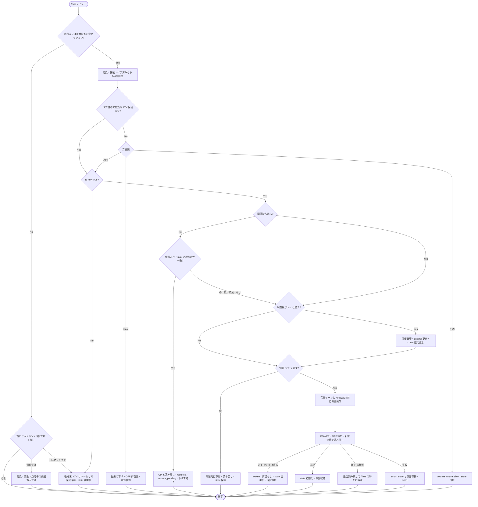

# ねむキャス (Nemucast) 🔊😴

リビングルームのテレビを 20:00 に切り、Dell（モニターに挿した Chromecast）は夜間に音量を段階的に下げて電源 OFF を試すツールです。

Dell の自動制御はローカル時刻の 21:00〜06:00 に開始し、新鮮な進行中セッションは窓外でも完走します。手動の音量上昇で待ち時間を数え直し、電源を切る直前に元の音量へ戻します。Dell はペアリング済みなら Android TV Remote の POWER、未ペアリングなら `quit_app` を試すところまでです。リビングルームは 20:00 の即 OFF だけを行い、夜間窓の対象から外します。

Dell は 2026-11-10 にペアリング済み。電源 OFF は 2026-11-10 22:13 の実機試験で `is_on` が True→False になることを確認済み（CEO も目視で確認）です。


## 🎯 機能

- **活動判定を state で保持**: `last_auto_volume` と `inactive_streak` を JSON に保存します
- **手動上昇を検出**: 前回の自動設定音量より上がっていれば活動ありとみなします
- **定期実行にも連続実行にも対応**: 1回だけの tick 実行と、standby まで継続する session 実行の両方をサポートします
- **夜間に開始する自動制御**: ペアリング済みの点灯または Backdrop 以外のアプリ起動を確認してから音量を操作し、新鮮な進行中セッションは窓外でも完走します
- **2 つの運用を同時に動かす**: 20:00 の即 OFF（`nemucast-standby`）と、深夜の段階的 OFF（`nemucast-auto`）。別々の periodic-worker タスクです

## 📋 必要な環境

- Python 3.11 以上
- 同一ネットワーク上に Chromecast / Google TV デバイス
- `uv`

## 🚀 インストール

```bash
git clone https://github.com/noricha-vr/nemucast.git
cd nemucast
uv sync
cp .env.example .env
```

## ⚙️ 基本設定

| 環境変数 | 説明 | デフォルト |
|---------|------|-----------|
| `CHROMECAST_NAME` | 20:00 の `nemucast-standby`・ペアリング・手動実行の対象。運用では `リビングルーム` に設定 | `"Dell"`（従来どおり） |
| `STEP` | 1回で下げる音量幅 | `-0.04` |
| `MIN_LEVEL` | これ以上は下げない最小音量 | `0.3` |
| `INTERVAL_SEC` | 定期実行の想定間隔 | `1200` |
| `INACTIVE_THRESHOLD` | 連続非アクティブ回数のしきい値 | `3` |
| `MANUAL_RISE_THRESHOLD` | 手動上昇とみなす最小差分 | `0.01` |
| `STATE_FILE` | state JSON の保存先 | `logs/activity_state.json` |
| `STATE_STALE_INTERVAL_MULTIPLIER` | state を古いとみなす倍率 | `2` |
| `RUN_UNTIL_STANDBY` | standby まで interval ごとに継続実行するか | `0` |

state は `INTERVAL_SEC x STATE_STALE_INTERVAL_MULTIPLIER` より古いと破棄されます。

## 📖 使い方

### 1回だけ判定する通常実行

```bash
uv run nemucast
uv run nemucast --interval 900 --inactive-threshold 4
```

### standby まで継続する実行

```bash
uv run nemucast --interval 900 --inactive-threshold 4 --run-until-standby
```

## 🕘 タイマー用プロファイル

### テレビの電源を切る

- コマンド: `nemucast-standby`
- 動き:
  - Cast の発見結果から IP を得て（mDNS に出ない時は同じ名前で最後に見えた IP）、Android TV Remote v2 でテレビ本体の電源を切ります
  - POWER キーはトグルなので、`is_on` を読んで点いている時だけ送り、新規接続で `is_on=False` を読み戻して確認します（切れなければ最大 `TV_POWER_MAX_ATTEMPTS` 回）。元から切れていれば何も送らず成功です
  - 見つからない・接続できない・切れない時は終了コード 1 と `DISCOVERY_ALERT_COMMAND` の通知
  - 音量は触りません。state ファイルも使いません
- 初回ペアリング（1 回だけ）: `nemucast-tv-pair --pin-file <PIN を書くファイル> --need-file <PIN 要求を書くファイル>`。テレビに出た PIN を `--pin-file` に書くと完了し、証明書・鍵を `TV_CERT_DIR`（既定 `~/.config/nemucast`、0600）に保存します
- 環境変数: `TV_CERT_DIR`（既定 `~/.config/nemucast`）/ `TV_POWER_KEY`（既定 `POWER`）/ `TV_POWER_WAIT_SEC`（既定 10）/ `TV_POWER_MAX_ATTEMPTS`（既定 3）
- オプション:
  - `--name`: 対象デバイス名（デフォルト: `CHROMECAST_NAME` 環境変数 / `Dell`）
- 想定用途: リビングルームを 20:00 に即 OFF（タスク `nemucast-20`、`CHROMECAST_NAME=リビングルーム`）。Dell には向けません

### 自動寝かしつけ（夜間のみ）

- コマンド: `uv run --frozen nemucast-auto`
- periodic-worker は従来どおり 15 分間隔で 24 時間起動します。自動制御を開始する時間はローカル時刻の **21:00 以上、06:00 未満** です。
- 対象は `AUTO_TARGET_NAME`（既定 `Dell`）で、`CHROMECAST_NAME` とは独立です。リビングルームに夜間窓の処理を向けません。対象を変える時は CEO に確認します。時間外に新しいセッションは開始しません。

1. 時間外は新しいセッションを開始しません。`original_volume` があり state が新鮮なら完走します。stale なら後始末します。ATV は音量キーを送らず保留へ移します。Cast は従来どおり手動上昇を尊重して復元します。進行中セッションが無く保留だけあれば、対象を探して点灯中の保留復元だけ試します。接続・照合できなければ次 tick へ持ち越します。
2. Cast を発見し、`cast.wait` の後、ペアリング済みなら `read_power_state` で MAC を照合します。不一致や接続失敗時は、音量・生値ログ・アプリ判定より前に中断します（未ペアリング時は名前のみで選び、MAC を照合できません）。照合時に読んだ `is_on=True`、または status があり `app_id` が None・空文字・pychromecast の `IDLE_APP_ID`（Backdrop）以外なら視聴中です。追加の電源状態接続は行いません。未ペアリングはアプリ起動中だけで判定します。`is_on=False` でもアプリ起動中なら Cast 経路は制御します。ATV 経路は `is_on=True` の時だけキーを送ります。`is_idle`・`is_stand_by`・`is_active_input`・`player_state` は判定に使いません。どちらも満たさない時だけ `not_watching` と記録し、元音量が残っていれば時間外と同じ後始末（ATV は保留）を行い、state を初期化して終了します。
ペアリング済みで有効な ATV の保留があれば、Cast が正の音量を返しても ATV 経路を優先します（OFF 失敗後の再試行・後始末の優先順位は維持）。保留がない時の音量源は有効な正の Cast 音量なら `cast`、Cast が 0 以下（許容誤差 `1e-6`）・未受信・不正値で、ペアリング済みかつ MAC 照合後の ATV 音量（整数 `level`、`max>0`）が取れた時だけ `atv` です。ATV の 1 tick の下げ幅は `max(1, round(-STEP * max))` 段、下限は `max(1, ceil(AUTO_MIN_LEVEL * max))` 段とし、下限より小さい現在音量は上げません。各キーの送信後に新規接続・MAC 照合で読み戻し、その接続を次のキーに使います。実際に下がらなければ `volume_unchanged` としてカウントを据え置きます。ATV の手動操作は上昇・下降とも `level != last_lowered_to` で判定し、元音量を現在値へ更新して数え直します。OFF 失敗後の閾値持ち越しも同じ判定を先に行い、同値なら音量キーなしで POWER のみ再試行します。OFF を試す tick は音量キーを送らず、POWER 前に元音量と最後に置いた段を `AUTO_PENDING_RESTORE_FILE` に保存します。後始末（`cleanup` / `not_watching`）でもキーを送らず保留へ移し state を初期化します。点灯中に手動で音量が変わっていれば保留を破棄します。消灯中の ATV 音量（0 や 1）は信用せず読みません。次の点灯中 tick で機器名・max が一致し、現在音量が保留の `left_at` と等しい時だけ、既存のキーごとの読み戻しで元音量へ戻します（許容差 1 段）。成功は `restored`・count=0 で state を初期化し、その tick は下げません。失敗は WARNING と `restore_pending` を記録して保留を残します。各読み戻し接続でも `is_on=True` を確認し、復元途中に消灯または電源不明になったら音量値を採用せず、途中の進捗でも `left_at` を更新しないまま終了します。追加の電源確認接続は行いません。現在音量が違えば人の変更として保留を破棄し、通常処理を続けます。保留に有効期限はありません。窓外で進行中セッションが無ければ保留復元だけを試し、下げ・POWER は行いません。音量源または ATV の max が変わったら単位を混ぜずセッションを初期化し、元音量かカウントがある時だけ WARNING を出します。

必要な音量がどちらからも取れない時は `volume_unavailable` を WARNING と tick 要約に記録し、カウント・復元情報を保持して音量操作も電源 OFF もしません。通知は `AUTO_VOLUME_ALERT_FILE=logs/auto_volume_alert_state.json` にローカル日付の成功日を保存し、同日 1 回まで（失敗時は失敗が続く次 tick で再送）。視聴しておらず復元情報もない時は従来どおり `not_watching` で終了します。

3. 視聴中（ペア済みの点灯またはアプリ起動中）だけ音量を `STEP` ずつ下げます。最初の音量を `original_volume` に保存します。Cast は手動上昇、ATV は上昇・下降どちらの変更でも連続カウントをリセットし、元音量を更新します。
4. 有効な音量が下限 `AUTO_MIN_LEVEL`（ATV は換算した下限段）以下なら音量を変えずカウントだけ進めます。既定では **3 回目の tick で閾値に達し、その tick 内で電源 OFF を試します（ATV はこの tick に音量キーを送らず、前 tick の音量を維持）**（21:00 に開始すれば 21:15、21:30 と進み、21:30 に OFF 試行）。
5. ATV は切る前に音量を戻さず、保留を保存します。Cast は従来どおり切る直前に `original_volume` へ音量を戻し、読み戻しで確認します。ペアリング済み（名前に対応する MAC 登録あり）なら Android TV Remote の `power_off` を実行します。POWER は `is_on=True` の時だけ送り、新規接続で OFF を読み戻します。OFF を観測した後で再接続の `is_on=True` に戻った場合は `turned_on_again` とし、再送しません。auto の ATV 経路は `woken`・state 初期化・通知なしとし、保留を残します。standby は「点け直された」ログと終了コード 0 で終了します。OFF を一度も観測できない場合だけ、追加読み戻しでまだ True と確認してから最大 `TV_POWER_MAX_ATTEMPTS` 回まで送ります。失敗時はカウントと元音量を保持し、通知・終了コード 1 として次 tick で再試行します。
6. 未ペアリングなら `quit_app` を試します。失敗しても WARNING を記録して続行し、`power_off_unavailable` とペアリング方法をログと通知で知らせます。通知はローカル日付で 1 日 1 回まで、翌日は再通知し、通知失敗時は送信済み日を記録せず再送待ちだけを保持し、アプリ終了後や窓外でも次 tick で再送します。ペアリング済みになったら再送待ちを解除し、送信しません。壊れた通知ファイルは未通知として扱います。OFF 成功時と未ペアリングの分岐後は state を初期化します。Dell の初回・再ペアリング手順は `nemucast-tv-pair --name Dell --pin-file <PIN を書くファイル> --need-file <PIN 要求を書くファイル>` です。

| 環境変数 | 説明 | 既定値 |
|----------|------|--------|
| `AUTO_TARGET_NAME` | 夜間窓の対象。`CHROMECAST_NAME` と独立。対象変更は CEO に確認 | `Dell` |
| `AUTO_POWER_OFF_ALERT_FILE` | 未ペアリングによる電源 OFF 不可の通知日（YYYY-MM-DD）と再送待ち | `logs/auto_power_off_alert_state.json` |
| `AUTO_NIGHT_START` | 夜間窓の開始（ローカル時刻 HH:MM、含む） | `21:00` |
| `AUTO_NIGHT_END` | 夜間窓の終了（HH:MM、含まない）。`23:00`〜`02:00` のような日付またぎにも対応。同時刻は空の窓 | `06:00` |
| `AUTO_NIGHT_FORCE` | `1` なら時間帯を無視して動作。昼間の試験用 | `0` |
| `AUTO_RESTORE_VOLUME` | `1` なら ATV の OFF 時の復元を保留へ保存する。ATV の後始末は設定によらず保留し、既存保留も処理する。Cast は OFF 前に復元（後始末は設定によらず復元） | `1` |
| `AUTO_RESTORE_WAIT_SEC` | Cast 音量復元後、テレビが反映した値を読み戻して確かめる待ち時間（秒）。`set_volume` は応答を待たず、反映前に電源を切ると翌日の音量が 0 になった（実機）ため、確認してから電源を切る。確認できなくても電源OFFは続行し WARNING を出す | `5` |
| `AUTO_RESTORE_TOLERANCE` | Cast 読み戻しの許容差（ATV は 1 段以内） | `0.015` |
| `AUTO_ATV_VOLUME_WAIT_SEC` | ATV 音量の初回 push とキー送信後の更新通知を待つ秒数 | `5` |
| `AUTO_VOLUME_ALERT_FILE` | 音量取得不可の通知成功日と再送待ち | `logs/auto_volume_alert_state.json` |
| `AUTO_LOWERED_THRESHOLD` | 電源 OFF までの段階制御 tick 数（ATV 最終 tick はキーなし） | `3` |
| `AUTO_MIN_LEVEL` | 下限音量 | `0.05` |
| `AUTO_PENDING_RESTORE_FILE` | ATV の保留復元（有効期限なし）。一時ファイル + `os.replace` で保存 | `logs/auto_pending_restore.json` |
| `AUTO_STATE_FILE` | 自動制御の state 保存先 | `logs/auto_standby_state.json` |
| `AUTO_STATE_STALE_SEC` | 間隔が空いた時に連続カウントを捨てる秒数 | `1800` |
| `DISCOVERY_ALERT_COMMAND` | 通知コマンド。本文を末尾の引数で渡す。空なら通知しない | 空 |
| `DISCOVERY_ALERT_FILE` | LAN 0 台検知の通知済みフラグ | `logs/discovery_alert_state.json` |
| `DISCOVERY_ALERT_AFTER_TICKS` | LAN 0 台が連続した時の障害閾値。`0` で無効 | `2` |
| `DISCOVERY_MAX_RETRIES` | 発見一覧に目的名があるのに接続候補が空の時の追加探索回数（初回を除く） | `3` |
| `DISCOVERY_RETRY_WAIT_SEC` | 追加探索前の待ち秒数 | `1` |
| `AUTO_NOT_FOUND_ALERT_AFTER_TICKS` | 窓内の目的名不在が連続した時の通知閾値。15 分間隔で約 1 時間。`0` で無効 | `4` |
| `AUTO_NOT_FOUND_ALERT_FILE` | 目的名の不在回数・通知済みフラグ（LAN 0 台検知とは別） | `logs/auto_not_found_alert_state.json` |

`STEP`・`MANUAL_RISE_THRESHOLD` は他コマンドと共通です。auto の対象は `AUTO_TARGET_NAME` で独立しています。夜間・テレビ電源の設定は `.env.example` と `config.py` に同じ既定値で載せています。

- 対象 Cast だけが見つからない時は正常終了します。窓内で不在が既定 4 tick 続いたら一度だけ通知し、発見できたら回復も一度通知します。通知失敗時は次 tick で再送します。未通知の連続回数は stale でリセットし、通知済みの途切れは回復まで保持します。窓外では不在・回復とも記録を更新しません。LAN 全体で 0 台が続いた時は従来どおり ERROR・終了コード 2 とし、障害確定時と回復時に 1 回ずつ通知します。夜間窓の中だけこの検知を行います。
- launchd 配下では、そのプロセスに macOS の「プライバシーとセキュリティ > ローカルネットワーク」の許可が必要です。
- 音量に触れず視聴中の判定が続く場合も、夜間窓の中では3 tick 目で電源 OFF を試します（ATV の最終 tick はキー送信なし）。mDNS・CEC 値は視聴中の判定に使いません。ペアリング後に実際の電源を切る時は `power_off` 内で `is_on` を確認します。
- stale な state は連続カウントを捨てますが、復元用 `original_volume` は保持します。すでに閾値に達した電源 OFF の再試行も保持します。`volume_source` のない旧 state は Cast 比率として読みます。ATV は `volume_max`、整数の `original_volume` と `last_lowered_to` を持ちます。旧 `powered_off` / `volume_at_power_off` は使用しません。壊れた JSON は作り直して続行し、保存は一時ファイルと置き換えで行います。

### 2 つの運用と止め方

- リビングルームの 20:00 即 OFF = `nemucast-standby`（タスク `nemucast-20`、`CHROMECAST_NAME`）、Dell の夜間段階的 OFF = `nemucast-auto`（タスク `nemucast-auto`、`AUTO_TARGET_NAME`）。2 つは独立で、普段は両方 active のままにします。
- 片方だけ止めたい時は periodic-worker の status で足ります: `periodic-worker update nemucast-auto --status inactive`（戻す時は `active`）。

### periodic-worker 登録例

```bash
# 20:00 に即 standby
periodic-worker register \
  --name nemucast-20 --cron "0 20 * * *" --tz Asia/Tokyo \
  --cwd /path/to/nemucast \
  --command "/path/to/.venv/bin/nemucast-standby"

# 24h、15分間隔で起動（夜間窓内に開始・進行中は完走）
periodic-worker register \
  --name nemucast-auto --every 15m \
  --cwd /path/to/nemucast \
  --command "/path/to/.venv/bin/nemucast-auto"
```

## 🔧 nemucast-auto の動作の仕組み


```mermaid
flowchart TD
    Start([15分タイマー]) --> Window{窓内または新鮮な進行中セッション?}
    Window -->|Yes| Discover[発見・接続・ペア済みなら MAC 照合]
    Window -->|No| Outside{古いセッション / 保留だけ / なし}
    Outside -->|古いセッション| Cleanup[後始末: ATV はキーなしで保留保存・state 初期化]
    Outside -->|保留だけ| PendingOnly[発見・照合・点灯中の保留復元だけ]
    Outside -->|なし| End([終了])
    Discover --> HasPending{ペア済みで有効な ATV 保留あり?}
    HasPending -->|Yes| On
    HasPending -->|No| Source{音量源}
    Source -->|Cast| Cast[従来の下げ・OFF 前復元・電源制御]
    Source -->|ATV| On{is_on=True?}
    Source -->|不明| Unavailable[volume_unavailable・state 保持]
    On -->|No| Cleanup
    On -->|Yes| Retry{閾値持ち越し?}
    Retry -->|No| Pending{保留あり・max と現在段が一致?}
    Pending -->|Yes| Restore[UP と読み戻し・restored / restore_pending・下げず終了]
    Pending -->|不一致は破棄 / なし| Manual
    Retry -->|Yes| Manual{現在段が last と違う?}
    Manual -->|Yes| Reset[保留破棄・original 更新・count 数え直し]
    Manual -->|No| Threshold
    Reset --> Threshold{今回 OFF を試す?}
    Threshold -->|No| Lower[段階的に下げ・読み戻し・state 保存]
    Threshold -->|Yes| SavePending[音量キーなし・POWER 前に保留保存]
    SavePending --> Off[POWER・OFF 待ち・新規接続で読み戻し]
    Off -->|OFF 後に点け直し| Woken[woken・再送なし・state 初期化・保留維持]
    Off -->|OFF 未観測| Recheck[追加読み戻しで True の時だけ再送]
    Off -->|成功| Clear[state 初期化・保留維持]
    Off -->|失敗| Fail[error・state と保留保持・exit 1]
    PendingOnly --> End
    Cleanup --> End
    Cast --> End
    Restore --> End
    Lower --> End
    Woken --> End
    Clear --> End
    Recheck --> End
    Fail --> End
    Unavailable --> End
```

### コマンド別の対比

| 項目 | `nemucast-standby` | `nemucast-auto` | `nemucast`（手動） |
|------|--------------------|------------------|--------------------|
| 対象 | リビングルーム / `CHROMECAST_NAME` | Dell / `AUTO_TARGET_NAME` | `CHROMECAST_NAME` |
| 想定スケジュール | 時刻指定（例: 20:00） | 15分間隔・夜間に開始して完走 | 任意のタイミングで手動実行 |
| 音量制御 | しない（テレビ本体の電源を切る） | する | する |
| state | 持たない | `auto_standby_state.json` + `auto_pending_restore.json` | `activity_state.json` |
| 電源OFF条件 | 即時 | 段階制御の 3 tick 目（ATV 最終 tick はキーなし） | 連続 N tick 非アクティブ |
| 用途 | ハードな時刻カットオフ | 寝落ち検知の自動運転 | デバッグ・手動投入 |

## 📝 ログと state

- 即時 standby ログ: `logs/standby.log`
- 自動寝かしつけログ: `logs/auto_standby.log`。`tick 結果: lowered / outside_window / cleanup / not_watching / turned_off / not_found / power_off_unavailable / volume_unavailable / volume_unchanged / restored / restore_pending / woken / error` と音量復元・カウントを記録します。接続・機器照合後は毎 tick、`対象機器の生値: device=... is_on=... app_id=... display_name=... is_idle=... is_stand_by=... is_active_input=... volume=... volume_source=cast|atv|none [atv_level=n/max]` を INFO に 1 行出します。`app_id` / `display_name` は制御文字を escape し、各 64 文字以内に制限します。ペアリング後の OFF 試行時にすでに消灯なら `power_off` の戻り値 `already_off` も記録します
- 確認例: `rg "判断:|tick 結果:|tick 要約:|POWER 読み戻し:|対象機器の生値:|音量復元|ERROR" logs/auto_standby.log`。初回の夜間運転後、ATV は OFF 前に復元していないこと、点け直し時に POWER を再送していないこと、窓の外で新規セッションが始まっていないこと（進行中なら `lowered` は正常）を確認します
- 各機器処理の正常終了時と例外時（`result=error`、不明な観測値は `None`）に `tick 要約:` を 1 行出します。`grep "tick 要約" logs/auto_standby.log` で、操作前の `is_on` / `app_id`、`volume_before`（開始音量）/ `volume_after`（終了時の目標音量）、`count`、`result`、`volume_source` を確認できます。ATV の音量は整数段で、末尾の `atv_level=n/max` は最後に確認できた読み戻し値です。未ペアの `is_on` と不明な音量は `None` です。音量を変えなければ前後は同値です。`count` はその tick の連続回数で、`not_watching` / `cleanup` は初期化後の 0、OFF 結果は初期化前の回数です。
- 手動実行ログ: `logs/lower_cast_volume.log`
- state:
  - `nemucast-auto` → `logs/auto_standby_state.json`
  - ATV の保留復元 → `logs/auto_pending_restore.json`（`device_name`, `level`=元音量, `left_at`=最後に置いた段, `max`, `created_at`=UNIX 秒。破損・対象違いは無視）
  - 目的名不在通知 → `logs/auto_not_found_alert_state.json`（LAN 0 台検知は `logs/discovery_alert_state.json`）
  - 音量取得不可の通知成功日 → `logs/auto_volume_alert_state.json`
  - 電源 OFF 不可の通知日 → `logs/auto_power_off_alert_state.json`
  - `nemucast`（手動） → `logs/activity_state.json`

## ✅ テスト

```bash
uv run pytest -q
uv run ruff check
```

## 🪝 pre-commit フック

コミット前に `ruff check` と `ruff format --check` が自動で走るよう pre-commit フックを用意しています。
初回セットアップ時に以下を実行してください。

```bash
uv sync --all-groups
uv run pre-commit install
```

手動で全ファイルに対して実行する場合:

```bash
uv run pre-commit run --all-files
```

### ATV の運用確認（#48）

- 実機の事実: 2026-11-14 14:32、消灯中に `VOLUME_UP` を送ると `is_on=False→True` となり画面が点いた。音量は OFF/ON をまたいで保持され、消灯中の `volume_info` は 0 や 1 を返すため使えない。OFF 前後・後始末で音量キーを送らない。
- 指標: ATV の各 tick を分母に `判断:` と `tick 要約:` を照合する。OFF tick・消灯中・後始末の音量キーは 0 件、OFF 観測後の POWER 再送は 0 件が期待値。`restored` / `restore_pending` / `woken` / `error` の件数を確認する。
- 置き場: `logs/auto_standby.log`（`判断:` の branch / is_on / level / last_lowered_to / original / count / pending / since_last_update、POWER の sent_off / is_on）。
- 確認方法: `rg '判断:|tick 要約:|音量変更:|音量復元|POWER|送信します' logs/auto_standby.log`。`restored` は復元だけの tick、次 tick に新しいセッションが始まることを確認する。
- 見直し日: 適用の 7 日後。実装委譲内では本番操作・通知登録は行わず、適用と観測の検収はリードが行う。
